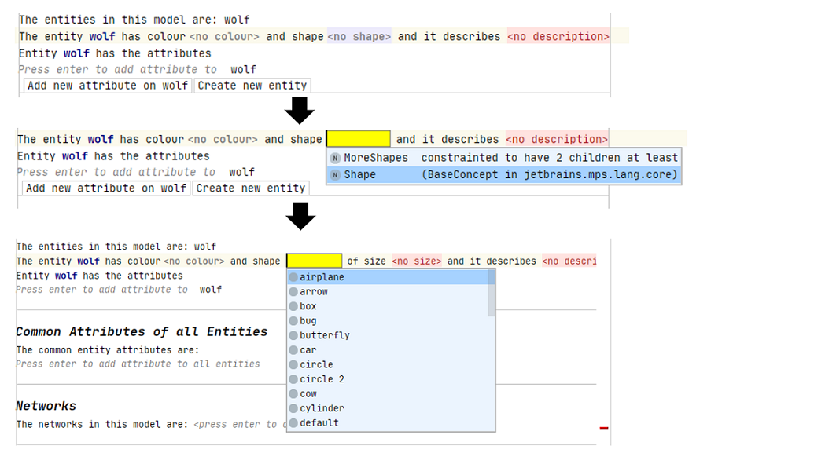
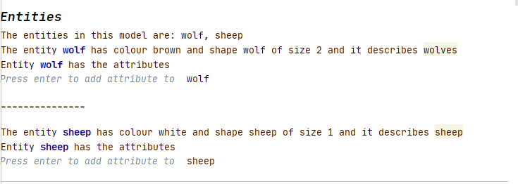
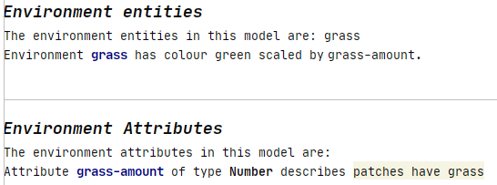

# Wolf Sheep in ODD2Netlogo
This document will serve as a tutorial for how to write the wolf sheep model in the ODD2Netlogo project. 

The Wolf Sheep model explores the stability of a predator-prey ecosystem. The system is unstable if one or more of the 
species involved in the simulation becomes extinct. If the species involved are able to endure over time, despite 
fluctuations in population sizes, the system can be deemed stable.
More details of the Wolf Sheep model can be found [here](https://ccl.northwestern.edu/netlogo/models/WolfSheepPredation).

## Making the model
### Setup
Before making the model, verify that the version of your MPS is the same as the one used in the project.
Next, generate the project by right clicking on `formalodd` in the Logical View of MPS (left sidebar) 
and clicking `Rebuld language 'formalodd'`, as seen below \

To create a new model, in the Logical View, open formalodd.sandbox, right click `odd` and select `New -> ODD` \

### General Tips
### Adding Elements 
Adding elements is done by pressing **ENTER** in the editor. Adding elements can either be done through clicking 
and marking a specific section belonging to a type of element, or to mark the last element of a list and pressing enter.

See examples:

**First element**\

**Adding to list of elements**\

#### Selecting Elements
Selecting elements is done by pressing **CTRL + Space**.

Example:

When selecting shape for an entity, click the field which has `<no shape>`, and press **CTRL + SPACE** for alternatives.
See image below.

\
Between each step we press ctrl+space to get further alternatives.

---

## Writing the model
After rebuilding the language, and creating a new `odd`, we can write the model in our editor.

#### Overview: Purpose
The first section of the editor is the **purpose**. This section lets the user answer general questions to get an overview of the model itself. These questions are as follows: 
1. What is the research question?
1. How would you categorize the role of the model?
1. For whom is the model designed?
1. Description of purpose:

When writing text, press enter to add new lines.\
None of these questions are required from a simulation perspective, and can be regarded as optional.

**Example**: Wolf-Sheep shortened Purpose\

### Overview:Entities, state variables and scales
#### Model Parameters
Model parameters are defined in this section, in this case we need numerous parameters defined for our model. \
These will serve as something similar to global variables, and is adjusted to change aspects the simulation.\
Insert the following attributes and give them type **Number**

1. `energy-gain-from-sheep`
1. `energy-gain-from-grass`
1. `grass-regrowth-rate`
1. `sheep-reproduce`
1. `wolf-reproduce`
1. `movement-cost`

It should look as follows in the editor: \

#### Entities
1. We need to identify all entities involved in a model. In our case we have the two entites: wolf and sheep.
1. Locate the Entities subsection, click on the text `<press enter to create entity>` and press enter to add an entity. \
    We need two entities for this model: `wolf` and `sheep`.\
    To add multiple entities, press the bottom-most empty line in the Entities section, and either use the 
    context assistant menu buttons, or press enter.\
    
1. For each of the entites, type the appropriate color, and select (using CTRL+space) an appropriate shape and size.
    
It should look as follows in the editor: \

    
#### Common Attributes of all Entities
In this model, all of the defined entities needs an attribute `energy`, and this can be added in this subsection.

1. Add the entity common attribute `energy`.

It should look as follows: \

1. 
    
    In this case, we want the color of the `grass` to be scaled, to indicate the amount of grass during the simulation.\
    Select ScaledColor, the color green and leave `<no attribute>` empty for now.

#### Environment Entities
In addition to entities, we can also add environment entities. In this case, we want the environment entity `grass`.\
1.Locate the Environment entities section and add a new environment entity and name it `grass`. 

#### Environment Attributes
1. Locate the section Environment Attributes, and add a new attribute `grass-amount` and set it to type **Number** \
1. Go back to the Environment Entity Grass, and set the ScaledColor attribute to the newly created `grass-amount`

How it should look in the editor: \

    
### Overview:Process overview and scheduling
The section process overview and scheduling contains the logic aspect of the model. We will define several  \
Actions and Interactions which will be callable and perform different functions during the simulation.

To create an Action or Interaction, go to the section Overview: Process overview and scheduling, and click on the `<click for options>`\
and press the needed  
##### Example Action `wiggle`
**Description**: the agent changes its heading - turn right then left, so the average is straight ahead

1. Create an Action and name it `wiggle`.
1. Make `wiggle` applicable to **any entity** by pressing ctrl+space on the empty field and selecting `AnyEntity`. 
1. Press enter and when on a new empty line press ctrl+space, and select `Turn`. Press the `expression` and hit \
ctrl+space on the beginning of the word. Select `RandomUniform`. In each of the new `expression` fields, press ctrl+space \
and select  **NumberConstant**, and place `0` and `90`.
1. Repeat the same process as above, but change the turn degrees to `-90` and `0`

See image for the resulting Action.

##### Action `move`
**Description**: the agent moves which costs it energy
1. Create an Action and name it `move`
1. Make it applicable to `AnyEntity`
1. On a new line, press ctrl+space and select Move, then set the distance to 1 pixel
1. Another new line, press ctrl+space and select `Decrement energy`, and in the field `<no rhs>`, press ctrl+space and
select the attribute `movement-cost`

See below for how it looks in MPS \

##### Interaction `eat-grass`
**Description**: sheep eat grass
1. Create an Interaction, and name it `eat-grass`
1. There are two parties in an interaction: Partner 1 and Partner 2. In this case Partner 1 is a concrete entity type, \
and partner 2 is an environment. To To insert concrete types select the option `ConcreteEntityReference` and then
select the specific entity to represent partner 1 and select sheep. For partner 2 select `AnyEnvironment`
1. We need to make sure that there is enough grass in the enviornment entity, and check this with a simple `if` clause.
To add an if, mark the `press enter to add actions`, press enter, and hit ctrl+space on the empty box. 
Select `ConditionalAction`. We want to compare the grass amount to see if it is enough for 1 bite (energy gained from grass). \
Select `Comparison` and on the first expression select `grass-amount` and on the last expression select `energy-gain-from-grass`, 
and make sure that the operator chosen is `>=`.
1. Inside this if clause we need to define what happens if the conditions are met. We want the grass to decrease and the sheeps energy to increase.\
On a new line, select  `increase energy` and set amount to the attribute `energy-gain-from-grass` \
On another new line select  `decrement grass-amount` and set the amount to the attribute `energy-gain-from-grass` 

See below for how it looks in MPS \

##### Interaction `eat-sheep`
**Description**: wolf eat sheep.
1. Create an Interaction, and name it `eat-sheep`.
1. There are two parties involved, both of which is a `ConcreteEntityReference`. Partner 1 is `wolf`, partner 2 is `sheep`.
1. First empty line, select `KillEntity` and make sure that the sheep (partner 2) is the target.
1. Increase the wolf's energy by adding new line, select `increase energy` and this is to be incremented by 
the attribute `energy-gain-from-sheep`.

See below for how it looks in MPS \

##### Action `check-if-dead`
**Description**: when energy dips below zero, the entity dies.
1. Create an Action, and name it `check-if-dead`.
1. Make it applicable to **AnyEntity**.
1. Make a `ConditionalAction`, and compare the `energy` attribute to make sure that it is operator < compared 
against the NumericConstant `0`.
1. If the condition is met, select `KillEntity` and partner 1 (self in this case).

See below for how it looks in MPS \

##### Action `reproduce`
**Description**: if this entity has enough energy to reproduce, then transfer energy to the offpsring.
1.  Create an Action, and name it `reproduce`.
1. Make it applicable to **AnyEntity**.
1. Made a `ConditionalAction` and a `Comparrison`, where the first expression is `energy` and
Compare this value `200` with the operator `>`
1. If this condition is fulfulled, then:
    1. Decrease energy by 100.
    1. Spawn 1 hatchling at the same location
    1. Attribute energy is set to 100.

See below for how it looks in MPS \

##### Action `regrow-grass`
**Description**: regrow the grass
1.  Create an Action, and name it `regrow-grass`.
1. Make it applicable to **AnyEnvironment**.
1. Made a `ConditionalAction` and a `Comparrison`, where the first expression is `energy` and
Compare this value `200` with the operator `>`
1. If this condition is fulfulled, then:
    1. Decrease energy by 100.
    1. Spawn 1 hatchling at the same location
    1. Attribute energy is set to 100.

See below for how it looks in MPS \

#### Initialization
We need to specify how the defined entities and attributes are initialized in the model. This is done in the section 'Details: Manual Experiments AKA Initialization'

1. Set all model parameters to be initialized by method of Slider.
1. Configure initial amount of both entities to be of type Slider. \
Set the initialization distribution to **random**.
1. Set the Share Attribute `energy` to be of type NumericConstant, and set it to `100`
1. Our Environment attribute `grass-amount` should be initialized randomly, press ctrl+space and select RandomUniform,
in each of the `expression` blocks: go to the beginning of the text and hit ctrl+space and select **NumberConstant**, 
and specify the  lower and upper limits to `0` and `100` respectively.
1. Configure the grass environment initial location to `everywhere`

#### Process overview and scheduling

## Running the model

